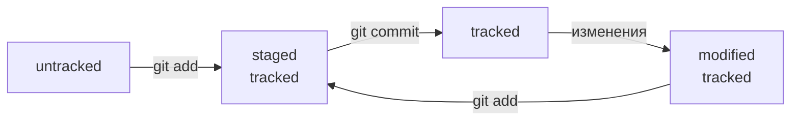

# Шпаргалка по Git


## Команды Git на примере `GitCheatSheet`
### Создать репозиторий
1. Создать каталог для проекта
1. Перейти в него
1. Инициализировать репозиторий

```console
mkdir GitCheatSheet
cd GitCheatSheet/
git init
```

### Удалить репозиторий
1. Перейти в каталог с репозиторием
1. Удалить каталог `.git`

```console
cd GitCheatSheet
rm -rf .git
```

### Проверить состояние репозитория
```console
git status
```

`git status` не выводит информацию об игнорируемых файлах. Чтобы отобразить все игнорируемые файлы, нужно использовать следующее:
```console
git status --ignored
```


### Подготовить файлы к сохранению
```console
git add file_name.txt # подготовить к сохранению 1 файл
git add file1.txt file2.txt # подготовить к сохранению несколько файлов
git add --all # подготовить к сохранению все файлы в репозитории
git add . # подготовить к сохранению всю текущую папку
```

### Выполнить коммит
```console
git commit # будет открыт текстовый редактор, для ввода комментария к коммиту
git commit -m 'Мой первый коммит!' # коммит с комментарием, введённым из командной строки
```

### Вывести историю коммитов
```console
git log
```

`git log` выводит коммиты в обратном хронологическом порядке - последние коммиты оказываются первыми сверху

Следующая команда выводит историю коммитов в сокращённом формате:
```console
git log --oneline
```

### Изменть последний коммит
```console
git commit --amend
```
Чтобы изменить содержимое коммита без изменения сообщения:
```console
git commit --amend --no-edit
```
Чтобы изменить только сообщение:
```console
git commit --amend -m 'новый текст сообщения'
```


### Клонирование удалённого репозитория
```console
git clone <адрес_репозитория>
```

После клонирования репозитория не требуется связывание удалённого и локального репозитория, а также выполнение команды `git push -u origin main` или других комадн, связывающих ветви `main` в удалённом и локальном репозитории.

### Связать удалённый и локальный репозиторий
В каталоге с репозиторием выполнить
```console
git remote add origin <адрес_репозитория> 
```

После связывания первую отправку фиксаций в удалённый репозиторий нужно выполнять следущим образом:
```console
git push -u origin main
```

### Проверить, что удалённый и локальный репозитории связаны
```console
git remote -v
```

### Отправить изменения в удалённый репозиторий
```console
git push
```

### Получить изменения из удалённого репозитория
```console
git pull
```

### "Откатить" изменения, которые не попали ни в staging, ни в коммит
```console
git restore <file>
```

### Убрать файл из staging area
```console
git restore --staged <file>
```
Чтобы убрать все файлы можно использовать следующую команду
```console
git restore --staged .
```

### "Откатить" коммит и удалить последующие
```console
git reset --hard <commit hash>
```

### Проверить изменения в файлах
Для файлов, недобавленных в staging area:
```console
git diff
```

Для файлов, добавленных в staging area:
```console
git diff --staged
```

Чтобы сравнить состояние файлов в двух разных коммитах:
```console
git diff <хеш коммита 1> <хеш коммита 2>
```

Сравнить ветки
```console
git diff <название_ветки1> <название_ветки2>
```

### Ветки
Чтобы посмотреть какие в проекте есть ветки и в какой из них мы сейчас находимся:
```console
git branch
```

Чтобы добавить ветку использовать
```console
git branch <имя ветки>
```

Чтобы переключиться на другую ветку
```console
git checkout <имя ветки>
```

Создать ветку и сразу переключиться на неё
```console
git checkout -b <название ветки>
```


## Хеш
**Хеш** - основной идентификатор коммита.

Хеш - это результат обработки информации о коммите (когда был сделан коммит, содержимое файлов в репозитории на момент коммита и ссылка на предыдущий коммит) алгоритмом вычисляющим хеш-функцию (функцию свёртки).

Обычно хеш - это короткая строка (длина зависит от алгоритма хеширования), состоящая из цифр (0-9) и латинских букв (A-F). Хеш обладает следующими свойствами:
- если хеш получить дважды для одного и того же набора входных данных, то результат будет гарантированно одинаковый;
- если в исходных данных поменяется бы один символ, то хеш тоже изменится (сильно).


## HEAD
Файл **HEAD** - один из служебных файлов папки `.git`. Он указывает на коммит, который сделан последним (то есть на самый новый). Внутри **HEAD** - ссылка на служебный файл: `refs/heads/main`, содержащий хеш последнего коммита.


## Жизненный цикл файла в Git



## Файл `.gitignore`
`.gitignore` - текстовый файл, где указаны файлы, которые Git будет игнорировать.

Правила из `.gitignore` применяются только к новым (untracked) файлам. Если файл уже попал в staging area или в коммит, то правила на него не распространяются.

Шаблоны (правила) - способ указать сразу на несколько файлов.
Синтаксис шаблонов `.gitignore`:
- `#` - комментарий;
- `*` - любая строка, включая пустую;
- `?` - один любой символ;
- `[...]` - любой символ из списка (диапазона), который указан в скобках;
- `/` - слеш указывает на каталоги. Если шаблон в `.gitignore` начинается со слеша, то Git проигнорирует файлы или каталоги только в корневой директории, если шаблон заканчивается слешем, то правило применится только к указанной папке;
- `**` - работает также как `*`, но отличие в работе с папками: `**` может соответствовать любому количеству папок (в т.ч. нулю), `*` - только одно папке;
- `!` - инверсия правила.
